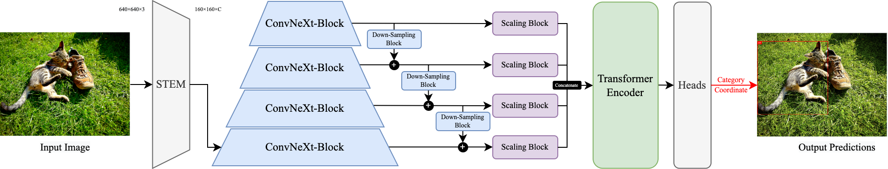

# FPDT: A Multi-Scale Feature Pyramidal Object Detection Transformer

*This is the codebase of my journal paper [FPDT: a multi-scale feature pyramidal object detection transformer](https://doi.org/10.1117/1.JRS.17.026510).*

## Model Architecture

For more details, please read our paper : [FPDT: a multi-scale feature pyramidal object detection transformer](https://doi.org/10.1117/1.JRS.17.026510).

## Pre-Trained Models

| Name       | Input Size | Parameters | Epochs | COCO AP | Download (.pth&.onnx)                                        |
| ---------- | ---------- | ---------- | ------ | ------- | ------------------------------------------------------------ |
| FPDT-Tiny  | $640^2$    | $34.2 M$   | $150$  | $34.1$  | [Google Drive](https://drive.google.com/drive/folders/1AqhIonqlklbfo-B8nPWX3nHVpT580Znu?usp=sharing) |
| FPDT-Small | $640^2$    | $72.6M$    | $150$  | $37.7$  | [Google Drive](https://drive.google.com/drive/folders/15-ateU6yni6etBe180E_gbNrCP2pl9Ku?usp=sharing) |

## Online Illustration

I've deployed the FPDT-Small model on my personal page [iyoc.xyz](https://iyoc.xyz/#/object-detection) as a feature, and the code of it is open sourced in my repo [AIIO](https://github.com/YOCdot/AIIO). Due to my bad frontend dev skills (noob JavaScript learner), the detection have to be done in the way of below demo video does :-(

